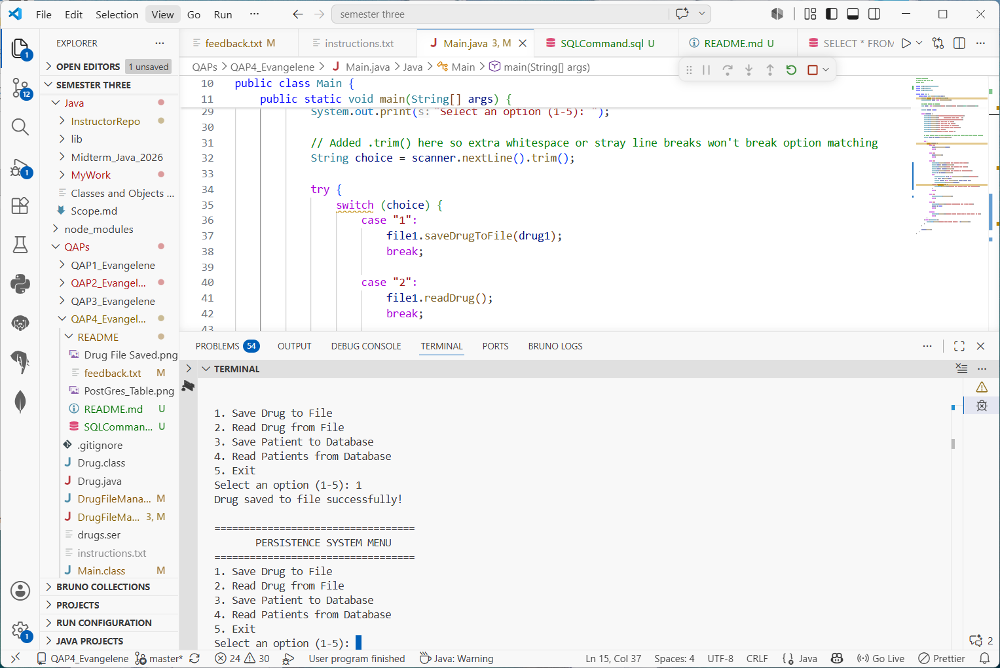
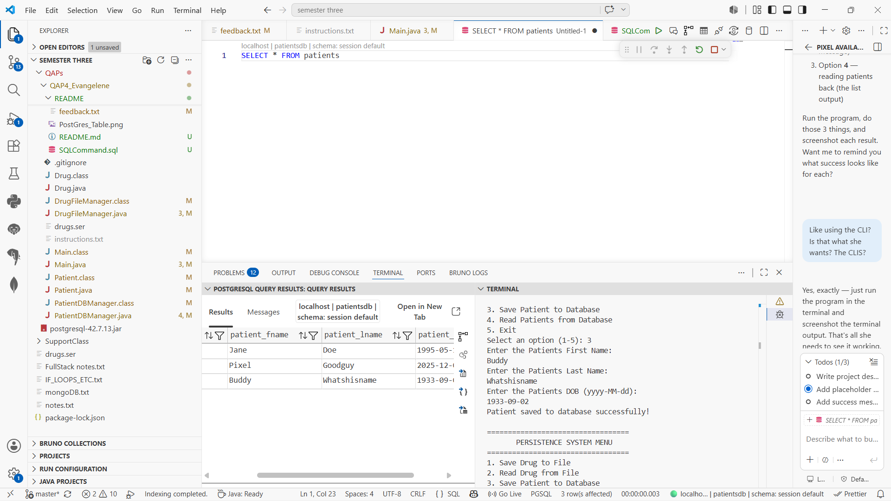
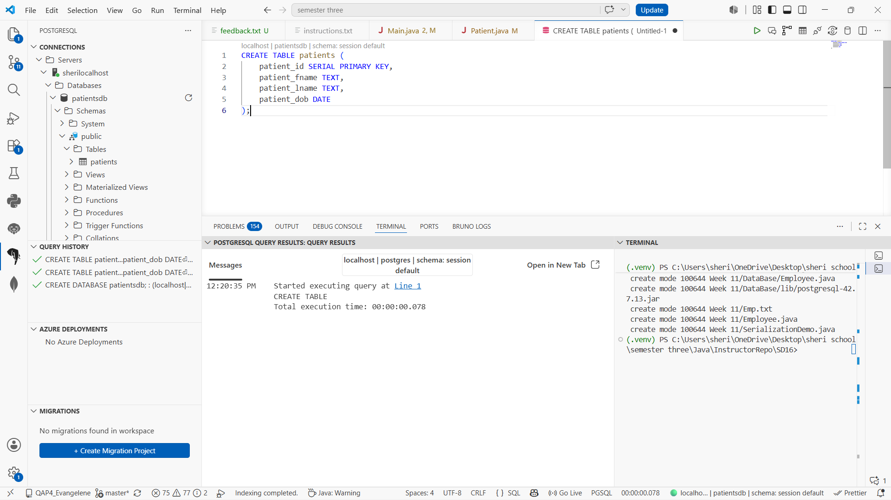
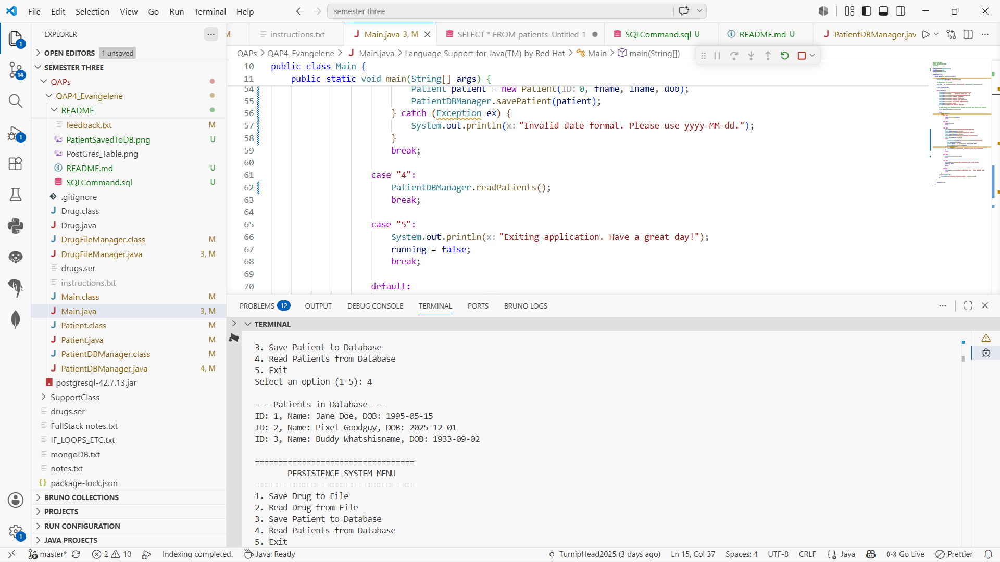

# Java QAP 4 - Data Persistence System
**Sheri Evangelene**

## Project Description
This is a Java console application that demonstrates two methods of data persistence:

1. **File I/O** - Drug data is saved to and read from a serialized `.ser` file using Java's file handling classes.
2. **Database I/O** - Patient data is saved to and read from a PostgreSQL database using JDBC.

The program provides a menu-driven interface with the following options:
- Save a Drug to a file
- Read Drug data from the file
- Save a Patient to the database
- Read all Patients from the database

### Entity Classes
- `Drug` (drugId, drugName, drugCost, dosage)
- `Patient` (patientId, patientFirstName, patientLastName, patientDOB)

### How to Run
```
javac -cp ".;postgresql-42.7.13.jar" *.java
java -cp "postgresql-42.7.13.jar;." Main
```

---

## How It Went
This project was genuinely difficult. I struggled with understanding how all the pieces connected — JDBC, PostgreSQL, file I/O — and there were moments I wasn't sure I'd get it working. But I kept going, and it works. I learned more from the struggle than I would have from it being easy.

---

## Screenshots

**Drug saved to file:**


**Patient saved to database:**


**PostgreSQL patients table:**


**Reading patients from database:**

